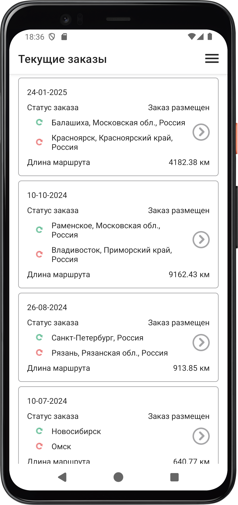
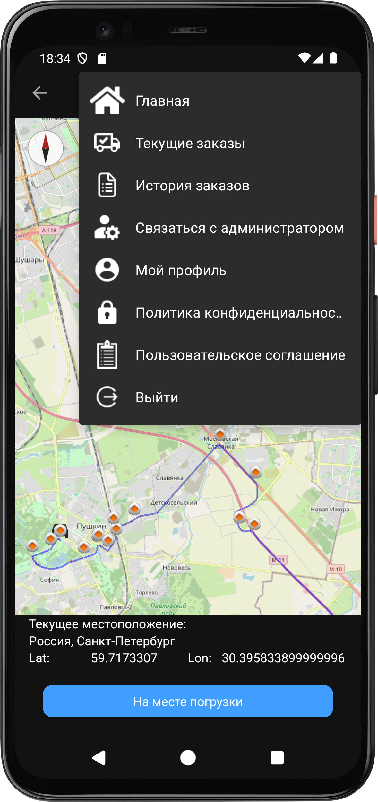

# Мобильное приложение для водителя транспортной компании* 

*В соответствии с Соглашением о конфиденциальности код проекта расположен в частном репозитории организации заказчика.

## О приложении

При первом запуске приложение запрашивает доступ к данным о местоположении устройства, который необходимо предоставить для корректной работы.

На первом экране приложение предлагает авторизоваться – войти по номеру телефона, после этого становится доступен экран текущих заказов, закрепленных за водителем с данным номером телефона.

Текущие заказы сохраняются в локальную базу данных и последующие запуски приложения не требуют авторизации, пользователь сразу попадает на экран «Текущие заказы».

По нажатию на стрелку в правой части карточки заказа водитель может просмотреть подробную информацию о заказе и принять его в работу. 

По нажатию на кнопку «Принять в работу» открывается экран «Статус заказа», на котором отображены все этапы доставки. Первый этап «Заказ принят в работу» отмечен выполненным.

Следующий этап «В пути к погрузке» отмечается выполненным по нажатию кнопки «Построить маршрут к месту погрузки». При этом открывается экран с построенным маршрутом от местоположения ТС до места погрузки.

По прибытию пользователь нажимает кнопку «На месте погрузки» и возвращается на экран статуса заказа.

По завершению погрузки водитель нажимает кнопку «Погрузка выполнена», статус заказа обновляется.

Следующий этап «В пути к доставке» отмечается выполненным по нажатию кнопки «Построить маршрут к месту доставки». При этом открывается экран с построенным маршрутом от местоположения ТС (которое в данный момент совпадает с местом погрузки) до места доставки.

При нажатии кнопки «На стоянке» активируется соответствующий этап статуса заказа и текст кнопки меняется на «Продолжить маршрут». После нажатия «Продолжить маршрут» снова появляется кнопка «На стоянке» на случай повторных остановок.

По прибытию к месту доставки пользователь нажимает «На месте доставки» и возвращается на экран статуса заказа, при этом активируется этап «На месте разгрузки».

По завершению разгрузки водитель нажимает кнопку «Разгрузка выполнена», статус заказа обновляется.

По кнопке «Загрузить документы» водитель загружает фото документов, подтверждающих выполнение доставки, после этого активируется этап «Доставка выполнена» и появляется кнопка «Завершить заказ».

По нажатию «Завершить заказ» текущая дата сохраняется как дата выполнения данного заказа и осуществляется переход на экран «Текущие заказы» с возможностью выбора нового заказа. 
Выполненный заказ при этом удаляется из текущих заказов и далее будет отображаться на экране «История заказов».

Этапы статуса заказа должны выполняться последовательно, при попытке перехода к этапу без выполнения всех предыдущих пунктов появляется соответствующее уведомление и этап не отмечается выполненным.

Этап «На стоянке» предполагается необязательным и не требуется для выполнения последующих пунктов.

* Состояние статуса заказа хранится в локальной базе данных, что при необходимости позволяет выполнять несколько заказов параллельно. На экране текущих заказов отображается статус каждого из заказов, а на экране «Детали заказа»  кнопка «Принять в работу» меняется на «Продолжить» в случае, если выполнение заказа было начато ранее.

Всплывающее меню доступно из любого экрана приложения и содержит пункт «История заказов» с краткой информацией по выполненным заказам, а также «Мой профиль» с информацией о пользователе.

При выходе из системы все данные о пользователе и о закрепленных за ним заказах стираются, о чем пользователя предупреждает соответствующее диалоговое окно.

## Обработка возможных ошибок

#### Текущие заказы не найдены: 
*	Если все текущие заказы были выполнены и экран не содержит данных для отображения, будет показано соответствующее пояснительное сообщение. 
*	Если текущие  заказы не были найдены сразу после авторизации, если пользователь ошибся при вводе номера телефона, будет предложено заново пройти авторизацию.

#### Координаты не найдены:
*	Если с сервера поступил заказ без указания координат при нажатии кнопки «Построить маршрут» будет показано соответствующее уведомление и переход на экран с картой не будет осуществлен, а последующие этапы статуса заказа будут доступны для выполнения.

#### Ошибка при переходе на фрагмент с картой:
*	Приложение не может определить местоположение устройства. Решение: закрыть приложение, открыть Google Maps, дождаться определения текущего местоположения устройства, заново открыть приложение.

## Темная тема

## Инструменты

* Osmdroid
* OSMBonusPack
* Figma 
* Retrofit
* OkHttp
* Coroutines
* Room
* Dagger Hilt
* ImagePicker
* java.time